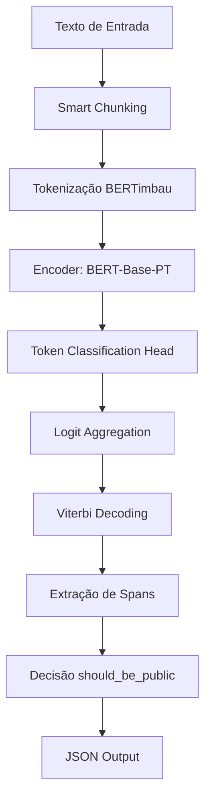

# Arquitetura Técnica

Este documento descreve a arquitetura da solução **PII Text Extractor**, desenvolvida para o Desafio Participa DF. A solução utiliza técnicas de Processamento de Linguagem Natural (NLP) para identificação automática de dados pessoais em textos de requerimentos administrativos.

## 1. Visão Geral do Pipeline

O pipeline de processamento é projetado para lidar com textos de qualquer extensão, garantindo alta performance e consistência entre as fases de treinamento e inferência.

## 2. Componentes Principais

### 2.1 Modelo de NER (Named Entity Recognition)
O núcleo da solução é um modelo de linguagem baseado na arquitetura Transformer:
- **Base:** `neuralmind/bert-base-portuguese-cased` (BERTimbau Base), pré-treinado em um vasto corpus de português.
- **Tarefa:** Classificação de tokens utilizando a taxonomia definida em `ner_labels.py`.
- **Esquema de Rótulos:** Utiliza o formato **IOB** (Inside-Outside-Beginning), permitindo identificar entidades compostas por múltiplos tokens (ex: nomes completos).

### 2.2 Smart Chunking (`data_preprocessing/chunking.py`)
Devido ao limite de 512 tokens do BERT, textos longos precisam ser fragmentados. O **Smart Chunking** resolve este problema de forma inteligente:
- **Respeito a Fronteiras:** Evita quebras no meio de palavras ou sentenças, buscando pontuações (`.`, `!`, `?`) ou quebras de linha para realizar o corte.
- **Overlap (Stride):** Mantém uma sobreposição de tokens entre fragmentos consecutivos, garantindo que entidades localizadas na borda de um fragmento sejam capturadas pelo contexto completo no fragmento seguinte.

### 2.3 Decodificação e Pós-processamento
Para garantir a validade das sequências de rótulos e a robustez da detecção:
- **Logit Aggregation:** Quando um token aparece em múltiplos chunks sobrepostos, suas probabilidades (logits) são agregadas (média) antes da decisão final.
- **Viterbi Decoding (`inference/decoding.py`):** Implementa o algoritmo de Viterbi com restrições de transição BIO. Isso impede erros comuns de modelos de classificação de tokens, como iniciar uma entidade com um rótulo `I-` (Inside) sem um `B-` (Beginning) correspondente.
- **Resolução de Conflitos:** Caso o modelo detecte spans sobrepostos com tipos diferentes, a solução resolve o conflito priorizando o span com maior confiança média.

## 3. Taxonomia de Entidades (conforme `ner_labels.py`)

A solução reconhece 13 tipos de entidades, divididas em duas categorias para fins de decisão de publicidade:

### 3.1 Entidades PII (Dados Pessoais)
Presença de qualquer uma destas entidades resulta em `should_be_public = false`:

| Entidade | Descrição |
|----------|-----------|
| `NOME_PESSOA` | Nomes de pessoas físicas (completo, social, parentes) |
| `DOC_PESSOAL` | CPF, RG, CNH, PIS/PASEP/NIT, Título de Eleitor, Passaporte |
| `DATA_NASC` | Datas de nascimento |
| `CONTATO` | E-mail, telefone, celular, WhatsApp |
| `ENDERECO` | Endereços físicos com logradouro/número/CEP |
| `DOC_PROFISSIONAL` | Matrícula funcional (SIAPE/GDF), OAB, CRM, CREA |
| `ID_PROCESSUAL` | Números de processo SEI, protocolos, boletins de ocorrência |
| `ID_VEICULO` | Placa, RENAVAM, chassi |
| `DADO_SAUDE` | Doenças, diagnósticos, CID, tratamentos, medicamentos |
| `DADO_FINANCEIRO` | Número de conta/agência, cartão, chave Pix |
| `QUASI_IDENTIFICADOR` | Combinação de dados que permite identificação indireta |

### 3.2 Entidades Não-PII (Contexto Útil)
Estas entidades são detectadas para enriquecer a análise, mas **não impedem** a publicidade do documento:

| Entidade | Descrição |
|----------|-----------|
| `ORG_JURIDICA` | Razão social, nome de empresa, órgão público |
| `DOC_EMPRESA` | CNPJ, Inscrição Estadual (IE), Inscrição Municipal (IM) |

### 3.3 Regra de Decisão
O campo `should_be_public` é definido como `false` se pelo menos uma entidade do subconjunto PII for detectada com confiança superior ao threshold configurado.

## 4. Requisitos de Performance e Deploy
- **Eficiência:** O pós-processamento é baseado em NumPy, mantendo o modelo base (BERT) puro e compatível com exportação para **ONNX** ou **TensorRT**.
- **Hardware:** Suporte nativo a execução em CPU e aceleração via CUDA (NVIDIA).
